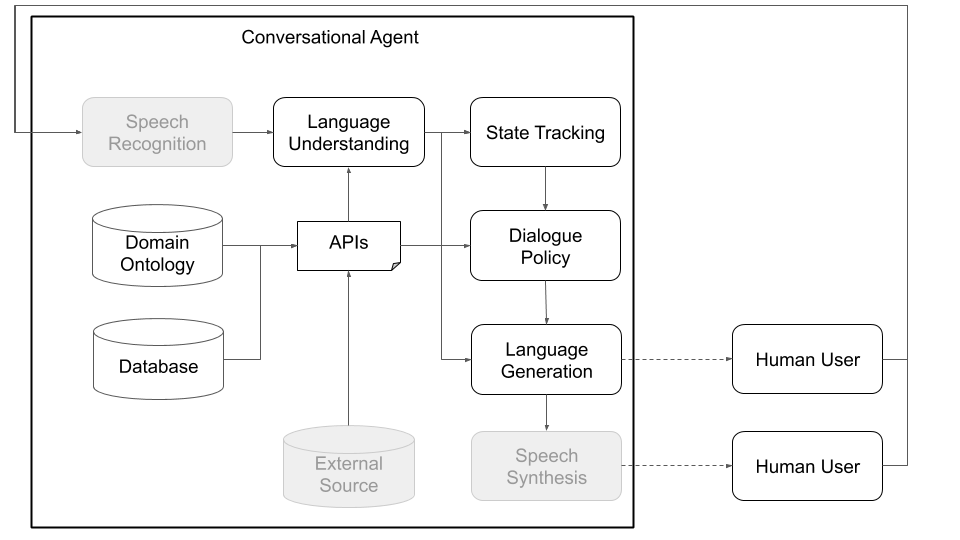
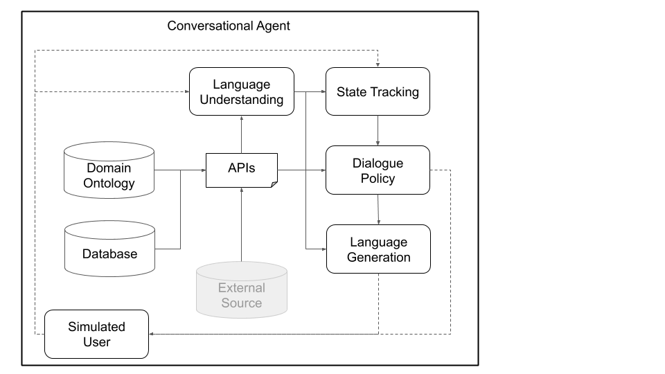

# Plato Research Dialogue System

This is a v 0.1 release.

The Plato Research Dialogue System is a flexible framework that can be used to 
create, train, and evaluate conversational AI agents in various environments. 
It supports interactions through speech, text, or dialogue acts and each 
conversational agent can interact with data, human users, or other 
conversational agents (in a multi-agent setting). Every component of every 
agent can be trained independently online or offline and Plato provides an 
easy way of wrapping around virtually any existing model, as long as Plato's 
interface is adhered to. 


Publication citations:

Alexandros Papangelis, Yi-Chia Wang, Piero Molino, and Gokhan Tur, 
“Collaborative Multi-Agent Dialogue Model Training Via Reinforcement Learning”, 
SIGDIAL 2019 [[paper](https://arxiv.org/abs/1907.05507)]

Alexandros Papangelis, Yi-Chia Wang, Mahdi Namazifar, Chandra Khatri, Piero 
Molino, and Gokhan Tur, "Plato Research Dialogue System: A Flexible 
Conversational AI Research Platform", ArXiv (to appear)

#### **News**
**New** [tutorial](#train-a-simple-end-to-end-seq2seq-model-for-metalwoz) on 
how to train a simple sequence to sequence model on MetalWOZ data. 
 
Contents:
1. [How does the Plato Research Dialogue System Work?](#how-does-the-plato-research-dialogue-system-work)
2. [Quick Start Guide](#quick-start-guide)
3. [Running Plato Agents](#running-plato-agents)
    1. [Running Generic Plato Agents](#running-generic-plato-agents)
    2. [Running Multiple Plato Agents](#running-multiple-plato-agents)
4. [Training from Data](#training-from-data)
    1. [Training with Plato](#training-with-plato)
    2. [Training with Plato and Ludwig](#training-with-plato-and-ludwig)
    3. [Training an End-to-End model](#train-a-simple-end-to-end-seq2seq-model-for-metalwoz)

# How does the Plato Research Dialogue System work?
Conceptually, a conversational agent needs to go through various steps in order 
to process information it receives as input (e.g., “What’s the weather like 
today?”) and produce an appropriate output (“Windy but not too cold.”). The 
primary steps, which correspond to the main components of a standard 
architecture (see Figure 1), are: 

* Speech recognition (transcribe speech to text)
* Language understanding (extract meaning from that text)
* State tracking (aggregate information about what has been said and done so far)
* API call (search a database, query an API, etc.)
* Dialogue policy (generate abstract meaning of agent’s response)
* Language generation (convert abstract meaning into text)
* Speech synthesis (convert text into speech)

Plato has been designed to be as modular and flexible as possible; it supports 
traditional as well as custom conversational AI architectures, and importantly,
enables multi-party interactions where multiple agents, potentially with 
different roles, can interact with each other, train concurrently, and solve 
distributed problems. 

Figures 1 and 2, below, depict example Plato conversational agent architectures
when interacting with human users and with simulated users. Interacting with 
[simulated users](https://pdfs.semanticscholar.org/5024/e0685f5ac8328129c5a4ae57f58109317063.pdf) 
is  a common practice used in the research community to 
jump-start learning (i.e., learn some basic behaviours before interacting 
with humans). Each individual component can be trained online or offline 
using any machine learning library (for instance, [Ludwig](https://uber.github.io/ludwig),
[TensorFlow](https://www.tensorflow.org/), [PyTorch](https://pytorch.org/), 
your own implementations) as Plato is a universal framework. Ludwig, Uber's open source deep 
learning toolbox, makes for a good choice, as it does not require writing 
code and is fully compatible with Plato. 


Figure 1: Plato's modular architecture means that any component can be trained 
online or offline and can be replaced by custom or pre-trained models. 
(Grayed components in this diagram are not core Plato components.)



Figure 2: Using a simulated user rather than a human user, as in Figure 1, we 
can pre-train statistical models for Plato's various components. These can then
be used to create a prototype conversational agent that can interact with human
users to collect more natural data that can be subsequently used to train 
better statistical models. (Grayed components in this diagram are not Plato 
core components.)

In addition to single-agent interactions, Plato supports multi-agent 
conversations where multiple Plato agents can interact with and learn from each
other. Specifically, Plato will spawn the conversational agents, make sure that
 inputs and outputs (what each agent hears and says) are passed to each agent 
 appropriately, and keep track of the conversation.

This setup can facilitate research in multi-agent learning, where agents need 
to learn how to generate language in order to perform a task, as well as 
research in sub-fields of multi-party interactions (dialogue state tracking, 
turn taking, etc.). The dialogue principles define what each agent can 
understand (an ontology of entities or meanings; for example: price, location, 
preferences, cuisine types, etc.) and what it can do (ask for more information,
provide some information, call an API, etc.). The agents can communicate over 
speech, text, or structured information (dialogue acts) and each agent has its 
own configuration. Figure 3, below, depicts this architecture, outlining the 
communication between two agents and the various components:


Figure 3: Plato's architecture allows concurrent training of multiple agents, 
each with potentially different roles and objectives, and can facilitate 
research in fields such as multi-party interactions and multi-agent learning. 
(Grayed components in this diagram are not core Plato components.)

Finally, Plato supports custom architectures (e.g. splitting NLU into multiple 
independent components) and jointly-trained components (e.g. text-to-dialogue 
state, text-to-text, or any other combination) via the generic agent 
architecture shown in Figure 4, below. This mode moves away from the standard 
conversational agent architecture and supports any kind of architecture 
(e.g., with joint components, text-to-text or speech-to-speech components, or 
any other set-up) and allows loading existing or pre-trained models into Plato.


Figure 4: Plato's generic agent architecture supports a wide range of 
customization, including joint components, speech-to-speech components, and 
text-to-text components, all of which can be executed serially or in parallel.

Users can define their own architecture and/or plug their own components into 
Plato by simply providing a Python class name and package path to that module, 
as well as the model’s initialization arguments. All the user needs to do is 
list the modules in the order they should be executed and Plato takes care of 
the rest, including wrapping the input/output, chaining the modules, and 
handling the dialogues. Plato supports serial and parallel execution of 
modules.

Plato also provides support for Bayesian optimization of conversational AI 
architectures or individual module parameters through Bayesian Optimisation of 
Combinatorial Structures (BOCS). 


Contents:
* Quick Start Guide
    * Understanding the configuration files
    * Running Plato Agents
    * Running multiple Plato Agents
    * Running generic Plato Agents
* Training from data
    * Plato internal experience
    * Training with Plato
    * Training with Ludwig
* Create a new domain
* Create a new component
    * Inheriting from the abstract classes
    * Creating a custom component
* Bayesian Optimisation in Plato
* Conclusion


# Quick Start Guide

## Installation

1. Clone this repository:
    ````
    git clone git@github.com:uber-research/plato-research-dialogue-system.git
    ````
2. Install the requirements:

    For MacOS:
    ````
    brew install portaudio
    pip install -r requirements.txt
    ````
    
    For Ubuntu/Debian:
    ````
    sudo apt-get install python3-pyaudio
    pip install -r requirements.txt
    ````
    
    For Windows:
    ````
    pip install -r requirements.txt
    ````
    
3. Run Plato! 

    See below for a quick introduction to the configuration files and how to 
    run your first Plato agent.

To support speech it is necessary to install [PyAudio](https://pypi.org/project/PyAudio/), 
which has a number of dependencies that might not exist on a developer's 
machine. If the steps above are unsuccessful, this [post](https://stackoverflow.com/questions/5921947/pyaudio-installation-error-command-gcc-failed-with-exit-status-1) 
on a PyAudio installation error includes instructions on how to get these 
dependencies and install PyAudio. 

#### Common Issues During Installation:
"CommonIssues.md" file contains common issues and their resolution that a user 
might encounter while installation.


## Running Plato Agents

Plato uses a Controller class to orchestrate the conversation between the
agents. The Controller will instantiate the agents, initialize them for each
dialogue, pass input and output appropriately, and keep track of statistics.


To run a Plato conversational agent, the user must run the following command 
with the appropriate configuration file (see Examples/simulate_agenda.yaml for 
an example configuration file which contains a number of settings on the 
environment and the agent(s) to be created as well as their components):


````
python runPlatoRDS.py -config PATH_TO_CONFIG_FILE.yaml
````

Some examples are listed below.


To run a simulation using the agenda based user simulator in the Cambridge 
Restaurants domain:

````
python runPlatoRDS.py -config Examples/config/simulate_agenda.yaml
````


To run a text based interaction using the agenda based simulator in the 
Cambridge Restaurants domain:

````
python runPlatoRDS.py -config Examples/config/simulate_text.yaml
````


To run a speech based interaction using the agenda based simulator in the 
Cambridge Restaurants domain:

````
python runPlatoRDS.py -config Examples/config/simulate_speech.yaml
````


## Running multiple Plato Agents

One of Plato's main features allows two agents to interact with each other. 
Each agent can have a different role (for instance, system and user), different 
objectives, and receive different reward signals. If the agents are 
cooperating, some of these can be shared (e.g., what constitutes a successful 
dialogue). (In the future, we plan to build support for Plato to enable 
interaction between more than two agents at a time.) 

For example, to run multiple Plato agents on the benchmark Cambridge 
Restaurants domain, we run the following commands to train the agents’ 
dialogue policies and test them:


- Training phase
    ````
    python runPlatoRDS.py -config Examples/config/CamRest_MA_train.yaml
    ````

- Testing phase
    ````
    python runPlatoRDS.py -config Examples/config/CamRest_MA_test.yaml
    ````


## Running generic Plato Agents

Most of the discussion and examples in this guide revolve around the 
traditional conversational agent architecture. Plato, however, does not need to 
adhere to that pipeline; its generic agents support any range of custom 
modules, from splitting natural language understanding into many components to 
having multiple components running in parallel to having just a single 
text-to-text model. 

Generic agents allow users to load their custom modules as Python class 
objects. For each module listed in the configuration file, Plato will 
instantiate the class using the given path and arguments. Then, during each 
dialogue turn, the generic agent will sequentially call each module (in the 
order provided in its configuration file) and will pass the output of the 
current module to the next module in the list. The generic agent will return 
the last module’s output. 

the following are two examples of running a single Plato agent or multiple 
Plato agents in the generic module mode:

- Single generic agent, used to implement custom architectures or to use 
existing, pre-trained statistical models:

    ````
    python runPlatoRDS.py -config Examples/config/simulate_agenda_generic.yaml
    ````

- Multiple generic agents, same as above but for multiple agents (assuming you 
have trained dialogue policies using Examples/config/CamRest_MA_train.yaml):
    ````
    python runPlatoRDS.py -config Examples/config/MultiAgent_test_generic.yaml
    ````


# Training from data

Plato supports the training of agents’ internal components in an online 
(during the interaction) or offline (from data) manner, using any deep learning 
framework. Virtually any model can be loaded into Plato as long as Plato’s 
interface Input/Output is respected; for example, if a model is a custom NLU 
it simply needs to inherit from Plato's NLU abstract class, implement the 
necessary functions and pack/unpack the data into and out of the custom model.


## Plato internal experience 

To facilitate online learning, debugging, and evaluation, Plato keeps track of 
its internal experience in a structure called the Dialogue Episode Recorder, 
which contains information about previous dialogue states, actions taken, 
current dialogue states, utterances received and utterances produced, rewards 
received, and a few other structs including a custom field that can be used to 
track anything else that cannot be contained by the aforementioned categories

At the end of a dialogue or at specified intervals, each conversational agent 
will call the train() function of each of its internal components, passing the 
dialogue experience as training data. Each component then picks the parts it 
needs for training.

To use learning algorithms that are implemented inside Plato, any external 
data, such as DSTC2 data, should be parsed into this Plato experience so that 
they may be loaded and used by the corresponding component under training.

Alternatively, users may parse the data and train their models outside of Plato 
and simply load the trained model when they want to use it for a Plato agent.


## Training with Plato

Training online is as easy as flipping the 'Train' flags to 'True' in the 
configuration for each component users wish to train. 

To train from data, users simply need to load the experience they parsed from 
their dataset. As an example of offline training in Plato, we will use the 
DSTC2 dataset, which can be obtained from the 2nd Dialogue State Tracking 
Challenge website:

````
http://camdial.org/~mh521/dstc/downloads/dstc2_traindev.tar.gz
```` 

Once the download is complete, you need to unzip the file.

The ````runDSTC2DataParser.py```` script will parse the DSTC2 data for you, and save it
as Plato experience. It will then load that experience and train a Supervised
Policy:

````
python runDSTC2DataParser.py -data_path <PATH_TO_DSTC2_DATA>/dstc2_traindev/data/
````

You can test using the following configuration:

````
python runPlatoRDS.py -config Examples/config/simulate_agenda_supervised.yaml
````

Note that you may load your experience into Plato and then keep training your
model with Reinforcement Learning or other learning methods. 

While each component has its own training parameters (e.g. learning rate), the 
Conversational Agent defines the meta-parameters of training such as:
- length of the experience
- length of the minibatch 
- training interval (train after that many dialogues)
- how many epochs to train for at each training interval


## Training with Plato and Ludwig
[Ludwig](https://uber.github.io/ludwig/) is an open source deep 
learning framework that allows you to train models without writing any code. 
You only need to parse your data into .csv files, create a ludwig config 
(in YAML), that describes the architecture you want, which features to use from 
the .csv and other parameters and then simply run a command in a terminal.

Ludwig also provides an API, that Plato is compatible with. This allows Plato
to integrate with Ludwig models, i.e. load / save the models, train and query
them. 

In the previous section, the ````runDSTC2DataParser.py```` actually generated 
some .csv files as well that can be used to train NLU and NLG. If all went well, 
you can find them here: ````Data/data/````. Now, you need to write a 
configuration file that looks like this:

````

input_features:
    -
        name: nlg_input
        type: sequence
        encoder: rnn
        cell_type: lstm
        
output_features:
    -
        name: nlg_output
        type: sequence
        decoder: generator
        cell_type: lstm

training:
    epochs: 20
    learning_rate: 0.001
    dropout: 0.2
````

and train your model:

````
ludwig experiment 
       --model_definition_file Examples/config/ludwig_nlg_train.yaml 
       --data_csv Data/data/DSTC2_NLG_sys.csv 
       --output_directory Models/CamRestNLG/Sys/
````

The next step is to load the model in Plato. Go to the 
````simulate_agenda_nlg.yaml```` configuration file and update the path if 
necessary:

````
...

NLG:
    nlg: CamRest
    model_path: <PATH_TO_YOUR_LUDWIG_MODEL>/model

...
````


and test that the model works:

````
python runPlatoRDS.py -config Examples/config/simulate_agenda_nlg.yaml
````

Remember that Ludwig will create a new *experiment_run_i* directory each time 
it is called, so please make sure you keep the correct path in Plato's config 
up to date.

Note that Ludwig also offers a method to train your model online, so in 
practice you need to write very little code to build, train, and evaluate a
new deep learning component in Plato. 


## Train a simple end-to-end Seq2Seq model for MetalWOZ

You can download MetalWOZ from [here](https://www.microsoft.com/en-us/research/project/metalwoz/).

Plato supports jointly trained models through Generic Agents. Here we will see
the steps needed to create a simple seq2seq conversational agent from scratch.
Using MetalWOZ as an example, we need to do the following:

#### 1. Write a MetalWOZ data parser that reads the data and procudes CSV files
As we are only training a simple seq2seq model (text to text), we need our 
parser to extract user and system utterances. These will be saved in .csv files
that will be used by Ludwig in step 4.

For a simple implementation of a MetalWOZ parser, see 
````Data/data/Parse_MetalWOZ.py````

Please note that this parser will only parse one single file (one domain). You
can easily modify it, however, to fit your needs. Here is a sample of the 
output produced by the parser for the pizza ordering domain:

| user | system |
|------|--------|
|hi	   |Hello how may I help you?|
|I need placing an order for a pizza need help* | Certainly, what would you like to add to your order?|
|I want a pizza with mushroom, pepperoni, and bacon toppings |Unfortunately, this location is out of the bacon topping you requested. Would there be a different topping you'd like to replace it with?|
|How about pineapple|That topping is available. I've added a pizza with mushroom, pepperoni, and pineapple to your order. What size would you like?|
|Medium	| Alright, updated. Would you like to add more to your order?|
|That's all, thanks| Alright, your total is 14.99. Your pizza will be ready for pickup in approx. 20 mins.|

Note the first user utterance does not actually exist in the data. However,
we need something to prompt the model to produce the system's greeting - we 
could have used an empty sentence, or any other greeting (or a combination of 
these).

#### 2. Write a "run" script that calls the MetalWOZ data parser
You can run the example script as follows:

````python runMetalWOZDataParser.py -data_path <PATH_TO_METALWOZ_DATA>/dialogues/FILE.txt````
 
#### 3. Train an end-to-end model
To get started we can train a very simple model using Ludwig (feel free to use
your favourite deep learning framework here):

````

input_features:
    -
        name: user
        type: text
        level: word
        encoder: rnn
        cell_type: lstm
        reduce_output: null

output_features:
    -
        name: system
        type: text
        level: word
        decoder: generator
        cell_type: lstm
        attention: bahdanau
        loss:
            type: sampled_softmax_cross_entropy

training:
  epochs: 100
````

You can modify this config to reflect the architecture of your choice and train
using Ludwig:

````
ludwig train 
       --data_csv Data/data/metalwoz.csv 
       --model_definition_file Examples/config/metalWOZ_seq2seq_ludwig.yaml
       --output_directory "Models/JointModels/"
````

#### 4. Write a class inheriting from Conversational Module that loads and queries the model
This class simply needs to handle loading of the model, querying it 
appropriately and formatting its output appropriately. In our case, we need to 
wrap the input text into a pandas dataframe, grab the predicted tokens from 
the output and join them in a string that will be returned. See the class here:
````JointModels/MetalWOZSeq2Seq.py````

#### 5. Write a Plato generic yaml config and run your agent!
See ````Examples/config/metalwoz_generic.yaml```` for an example generic 
configuration file that interacts with the seq2seq agent over text. You can try
it out as follows:

````python runPlatoRDS.py -config Examples/config/metalwoz_generic.yaml````

**Remember** to update the path to your trained model if necessary! The default
path assumes you run the ludwig train command from Plato's root directory.

# Create a new domain

In order to build a conversational agent for task-oriented applications (such
as slot-filling), you need a *database* of items and an *ontology* describing 
your domain. Plato provides a script for automating this process.

Let's say for example that you want to build a conversational agent for a 
flower shop, and you have the following items in a .csv:

````
id,type,color,price,occasion
1,rose,red,1,any
2,rose,white,2,anniversary
3,rose,yellow,2,celebration
4,lilly,white,5,any
5,orchid,pink,30,any
6,dahlia,blue,15,any
````

You can simply call createSQLiteDB.py to automatically generate a .db SQL file 
and a .json Ontology file. If you want to specify informable, requestable, and
system-requestable slots, you may do so in the configuration file:

````
GENERAL:
  csv_file_name: Data/data/flowershop.csv
  db_table_name: flowershop
  db_file_path: Ontology/Ontologies/flowershop-dbase.db
  ontology_file_path: Ontology/Ontologies/flowershop-rules.json

ONTOLOGY:
  informable_slots: [type, price, occasion]

  requestable_slots: [price, color]

  System_requestable_slots: [type, price, occasion]

````

and run the script:

````
python createSQLiteDB.py -config Examples/config/create_flowershop_DB.yaml
````

If all went well, you should have a ````flowershop.json```` and a 
````flowershop.db```` into the ````Data/data/```` folder.

You can now simply run Plato's dummy components as a sanity check and talk to
your flower shop agent:

````
python runPlatoRDS.py -config Examples/config/flowershop_text.yaml
````


# Create a new component

There are two ways to create a new module depending on its function. If a 
module implements a new way of performing NLU or dialogue policy, then the user 
should write a class that inherits from the corresponding abstract class.

If, however, a module does not fit one of the single agent basic components, 
for example, it performs Named Entity Recognition or predicts dialogue acts 
from text, then the user must write a class that inherits from the 
ConversationalModule directly, which can then only be used by the generic 
agents. 


## Inheriting from the abstract classes

Users need to create a new class inheriting from the corresponding Plato 
abstract class and implement the interface defined by the abstract class and 
any other functionality they wish. This class should have a unique name (e.g. 
'myNLG') that will be used to distinguish it from other options when parsing 
the configuration file. At this version of Plato, users will need to manually 
add some conditions where the configuration files are being parsed (e.g. in 
the Conversational Agent, Dialogue Manager, etc.) unless the generic agent is 
used. 

## Creating a custom component

To construct a new module, the user must add their code to a new class 
inheriting from the conversational module. They can then load the module via a
generic agent by providing the appropriate package path, class name, and 
arguments in the configuration.


````
...
MODULE_i:
    package: myPackage.myModule
    Class: myModule
    arguments:
      model_path: Models/myModule/parameters/
      ...
...

````

**Be careful!** You are responsible for guaranteeing that the I/O of this 
module can be processed and consumed appropriately by modules before and after, 
as provided in your generic configuration file.

Plato also supports parallel execution of modules. To enable that you need to
have the following structure in your config:

````
...
MODULE_i:
    parallel_modules: 5
    
    PARALLEL_MODULE_0:
        package: myPackage.myModule
        Class: myModule
        arguments:
          model_path: Models/myModule/parameters/
          ...
          
    PARALLEL_MODULE_1:
        package: myPackage.myModule
        Class: myModule
        arguments:
          model_path: Models/myModule/parameters/
          ...
          
    ...
...

````

**Be careful!** Outputs from the modules executed in parallel will be packed
into a list. The next module (e.g. ````MODULE_i+1````) will need to be able
to handle this kind of input. **The provided Plato modules are not designed to 
handle this, you will need to write a custom module to process input from
multiple sources.**

# Bayesian Optimisation in Plato

Tutorial coming soon!

# Acknowledgements

Special thanks to Yi-Chia Wang, Mahdi Namazifar, Chandra Khatri, Piero Molino, 
Michael Pearce, Zack Kaden, and Gokhan Tur for their contributions and support,
and to [studio FF3300](http://ff3300.com/) for allowing us to use the Messapia 
font.

# Conclusion

This is the very first release of Plato. Please understand that many features
are still being implemented and some use cases may not be supported yet.

Enjoy!
